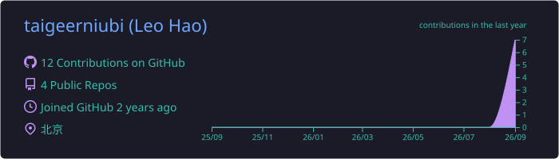
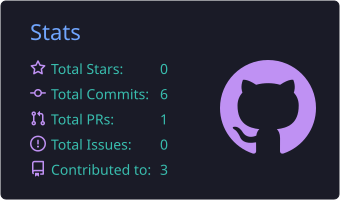
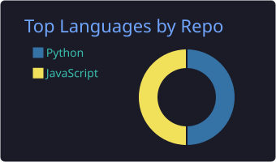
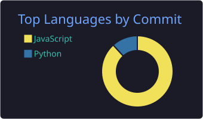
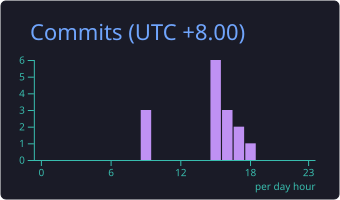

<!--
  GitHub 个人主页 README —— 仓库名必须是 taigeerniubi/taigeerniubi 才会显示在主页。
  搜索 TODO_ 可以找到所有需要你填的占位符（邮箱 / LinkedIn / 微信 等）。
  「My latest posts」区块由 .github/workflows/blog-posts.yml 自动填充（每天 08:00，以及每次 push 改动 README 时），不要手改那两行注释之间的内容。
-->

  

  
  

## 🤗 Hey! Nice to see you.

Welcome to my page!
I am **Leo**, an AI application engineer from 🇨🇳 **Beijing, China**.
I build LLM-powered agents, MCP servers and data pipelines — mostly in Python.

- 🔭 Currently working on: LLM agents, MCP tooling and automation pipelines
- 🌱 Currently learning: LLM fine-tuning (LoRA), agent evaluation, the MCP ecosystem
- ✍️ I write about what I build on my [blog](https://taigeerniubi.github.io)
- 📫 Reach me:   

## 🛠 Things I code with

  
  
  
  
  
  
  
  
  
  
  
  
  
  
  
  
  
  
  
  
  

## 🚀 Open source projects

<table>
  <thead>
    <tr>
      <th>🎁 Projects</th>
      <th>⭐ Stars</th>
      <th>🍴 Forks</th>
      <th>🛎 Issues</th>
      <th>📬 Pull requests</th>
    </tr>
  </thead>
  <tbody>
    <tr>
      <td><a href="https://github.com/taigeerniubi/KO_12306"><b>KO_12306</b></a> 12306 train-ticket query &amp; booking scripts</td>
      <td></td>
      <td></td>
      <td></td>
      <td></td>
    </tr>
    <!-- 再加一行：把下面的 TODO_REPO 换成公开仓库名后，删掉这行注释标记即可
    <tr>
      <td><a href="https://github.com/taigeerniubi/TODO_REPO"><b>TODO_REPO</b></a> TODO_一句话描述</td>
      <td></td>
      <td></td>
      <td></td>
      <td></td>
    </tr>
    -->
  </tbody>
</table>

## 📝 My latest posts

<!-- BLOG-POST-LIST:START -->
- 🔥 **[Agent Memory 的结构：短期、任务与长期记忆怎么配合](https://taigeerniubi.github.io/2026/09/11/Agent-memory/)** 2026-09-10
- 🔥 **[Agent 评测怎么做？从“看起来能用”到可重复的工程验证](https://taigeerniubi.github.io/2026/09/10/Agent-evaluation/)** 2026-09-10
- 🔥 **[Agent Harness 是什么？从一次工具调用看懂执行循环、上下文与 MCP](https://taigeerniubi.github.io/2026/09/10/Agent-harness/)** 2026-09-09
- 🔥 **[博客开张：为什么把博客放在 GitHub 上](https://taigeerniubi.github.io/2026/09/09/hello-world/)** 2026-09-09

<!-- BLOG-POST-LIST:END -->

➡️ [More posts on my blog...](https://taigeerniubi.github.io)

## 📊 GitHub stats

<!-- 下面的卡片由 .github/workflows/profile-cards.yml 每天生成并提交到仓库，不要手改 -->

  

  
  

  
  

  

## 🐍 Contribution snake

<picture>
  <source media="(prefers-color-scheme: dark)" srcset="https://raw.githubusercontent.com/taigeerniubi/taigeerniubi/output/github-snake-dark.svg" />
  
</picture>

---

README auto-updated by GitHub Actions · Made with ❤️ in Beijing

